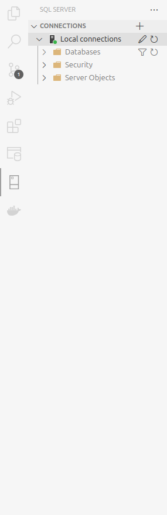
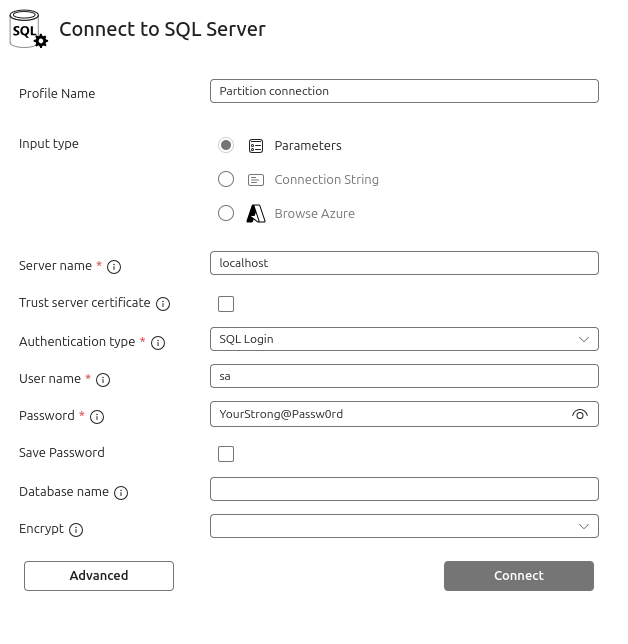

# SQL SERVER PARTITIONING
> By: Denis Jorge Gandarillas Delgado

## ¿Qué es Data Partitioning?

El **Data Partitioning** es una técnica de organización de datos que divide grandes tablas y índices en particiones más pequeñas y manejables, basadas en un criterio específico, como un rango de fechas o valores numéricos. Esta técnica permite distribuir los datos de una tabla en diferentes partes físicas del sistema, lo que puede mejorar el rendimiento y facilitar la administración de datos grandes.

## Ventajas del Data Partitioning

1. **Mejora en el rendimiento**:  
   - Al dividir grandes tablas en particiones más pequeñas, las consultas pueden ser más eficientes, ya que el motor de base de datos solo consulta las particiones relevantes.
   - Las operaciones de mantenimiento (como la eliminación o actualización de datos) se pueden realizar más rápido en particiones específicas, sin afectar toda la tabla.

2. **Administración más sencilla de grandes volúmenes de datos**:  
   - La partición hace que el manejo de datos más grandes sea más sencillo. Se pueden agregar, eliminar o archivar particiones sin impactar el rendimiento general de la base de datos.

3. **Mejora en la escalabilidad**:  
   - Es posible distribuir los datos de una tabla en diferentes dispositivos de almacenamiento, lo que aumenta la escalabilidad y la capacidad de almacenamiento.

4. **Optimización de backups y restauraciones**:  
   - Los backups y restauraciones pueden realizarse a nivel de partición, lo que optimiza el tiempo y los recursos utilizados para realizar estas operaciones.

5. **Optimización de consultas específicas**:  
   - Las consultas que afectan solo a una partición o un subconjunto de particiones se pueden realizar de forma más eficiente.

## Desventajas del Data Partitioning

1. **Complejidad adicional**:  
   - Configurar particiones requiere un conocimiento avanzado de SQL Server, y puede añadir complejidad en la administración de la base de datos.

2. **Posibles problemas de rendimiento si no se gestiona bien**:  
   - Si las particiones no están diseñadas correctamente (por ejemplo, si las filas están distribuidas de manera desigual), el rendimiento puede verse afectado, ya que algunas particiones pueden tener más datos que otras.

3. **Limitaciones de diseño**:  
   - No todas las tablas son adecuadas para particionamiento. El particionamiento es más útil cuando se tienen grandes volúmenes de datos con patrones de acceso predecibles.

4. **Mantenimiento de particiones**:  
   - A medida que crece la base de datos, puede ser necesario reorganizar las particiones, lo que puede generar una sobrecarga de mantenimiento.

## Tipos de Particiones en SQL Server

1. **Particiones Horizontales (Row-Level Partitioning)**  
   Este es el tipo más común de particionamiento, donde los datos de una tabla se dividen en particiones basadas en un valor de columna (por ejemplo, fechas, ID de cliente, etc.). Las particiones se definen mediante un **funcionamiento de partición** y un **rango de particiones**. SQL Server realiza una distribución de las filas en particiones basadas en el valor de la columna de partición.

   Ejemplo de columnas de partición comunes:
   - Fecha
   - Rango de ID
   - Estado o región geográfica

2. **Particiones Verticales (Column-Level Partitioning)**  
   En este caso, las particiones se basan en columnas, dividiendo la tabla en varias tablas más pequeñas, cada una con un subconjunto de columnas de la tabla original. Esto no es comúnmente utilizado, pero se emplea en casos donde las tablas tienen columnas grandes que se pueden distribuir de manera eficiente.

3. **Particiones de Índice (Indexed Partitioning)**  
   Los índices también pueden estar particionados, lo que ayuda a mejorar el rendimiento de las consultas sobre tablas particionadas. Los índices particionados se crean sobre las particiones y se benefician del particionamiento de las tablas subyacentes.

## Conceptos Clave en el Código

### 1. **Partition Function (Función de Partición)**
   - La **función de partición** define la lógica de cómo dividir los datos en particiones. En este ejemplo, la función `PartitionByBirthDate` divide los datos de la tabla según la fecha de nacimiento en rangos de años.
   - **Sintaxis**:  
     ```sql
     CREATE PARTITION FUNCTION PartitionByBirthDate (DATE)
     AS RANGE LEFT FOR VALUES ('2023-12-31', '2024-12-31', '2025-12-31');
     ```
   - Esto crea particiones con los límites de fecha especificados.

### 2. **Partition Scheme (Esquema de Partición)**
   - El **esquema de partición** especifica cómo se distribuirán las particiones definidas en la función de partición a través de diferentes grupos de archivos. En este caso, el esquema `SchemePartitionByBirthDate` mapea las particiones a diferentes grupos de archivos según el año.
   - **Sintaxis**:  
     ```sql
     CREATE PARTITION SCHEME SchemePartitionByBirthDate 
     AS PARTITION PartitionByBirthDate 
     TO (FG_2023, FG_2024, FG_2025, FG_2026);
     ```

### 3. **Filegroup (Grupo de Archivos)**
   - Un **filegroup** es un contenedor lógico que organiza archivos de datos en una base de datos. Cada partición se almacena en un **filegroup** específico, lo que facilita la administración y mejora el rendimiento.
   - Los **filegroups** utilizados en el código son `FG_2023`, `FG_2024`, `FG_2025`, y `FG_2026`, cada uno para almacenar los datos de las particiones correspondientes.
   - **Sintaxis para agregar un filegroup**:
     ```sql
     ALTER DATABASE PartitioningDB ADD FILEGROUP FG_2023;
     ```

### 4. **Data File (Archivo de Datos)**
   - Un **archivo de datos** es un archivo físico que contiene los datos reales de la base de datos. En este caso, los archivos `.ndf` (Non-Primary Data File) se usan para almacenar los datos de las particiones.
   - **Sintaxis para agregar un archivo de datos**:
     ```sql
     ALTER DATABASE PartitioningDB ADD FILE
     (
         NAME = P_2023, -- NOMBRE LÓGICO
         FILENAME = '/var/opt/mssql/data/P_2023.ndf'
     ) TO FILEGROUP FG_2023;
     ```

### 5. **Partitioned Table (Tabla Particionada)**
   - Una **tabla particionada** es una tabla cuyos datos están distribuidos en particiones definidas por la función y el esquema de partición. Los datos de esta tabla se almacenan en diferentes **filegroups** según el valor de la columna de partición (en este caso, `BirthDate`).
   - **Sintaxis para crear una tabla particionada**:
     ```sql
     CREATE TABLE dbo.UsersPartitioning_ByBirthDate
     (
         Id UNIQUEIDENTIFIER DEFAULT NEWID(),
         Firstname VARCHAR(64) NOT NULL,
         Lastname VARCHAR(64) NOT NULL,
         BirthDate DATE NOT NULL DEFAULT GETDATE(),
         Country VARCHAR(100) NOT NULL
     ) ON SchemePartitionByBirthDate (BirthDate);
     ```

## TALLER

1. Clonar el repositorio y dirigirse a la rama `docker`

``` bash
git clone https://github.com/denis-gandel/sql-server-partitioning.git
cd sql-server-partitioning
git checkout docker
```

2. Levantar el contenedor docker

``` bash
docker compose up --build
```

3. Ingresar a VSCode

``` bash
code .
```

4. Instalar las extensiones de MSSQL para VSCode 
> [SQL SERVER (mssql)](https://marketplace.visualstudio.com/items?itemName=ms-mssql.mssql)

5. Conectarse a la base de datos de MSSQL, mediante el logo


6. Click en el icono de `+`

Ingresa las siguientes credenciales

SERVER NAME = `localhost`

USERNAME = `sa`

PASSWORD = `YourStrong@Passw0rd`

> En caso de hacerlo mediante otra herramienta el puerto por defecto es el `1433`

7. Ejecutar todo el archivo `partitioning.sql`
Solo debe ingresar al archivo, seleccionar todo el contenido y ejecutar con la combinacion de teclado `ctrl+shift+e`

8. Ejecutar archivo `insertValues.sql`, para rellenar los campos con datos necesarios

9. Probar los queries desde el comentario
``` sql
-- TEST SQL QUERIES

SELECT * FROM dbo.UsersPartitioning_ByBirthDate;

SELECT 
    p.partition_number AS PartitionNumber,
    f.name AS PartitionFilegroup,
    p.rows AS NumberOfRows
FROM sys.partitions p
JOIN sys.destination_data_spaces dds ON p.partition_number = dds.destination_id
JOIN sys.filegroups f ON dds.data_space_id = f.data_space_id
WHERE OBJECT_NAME(p.object_id) = 'UsersPartitioning_ByBirthDate';

SELECT * 
FROM dbo.UsersPartitioning_ByBirthDate
WHERE YEAR(BirthDate) = 2023;

SELECT * 
FROM dbo.UsersPartitioning_ByBirthDate
WHERE YEAR(BirthDate) = 2024;

SELECT * 
FROM dbo.UsersPartitioning_ByBirthDate
WHERE YEAR(BirthDate) = 2025;

SELECT * 
FROM dbo.UsersPartitioning_ByBirthDate
WHERE YEAR(BirthDate) = 2026;

SELECT * 
FROM dbo.UsersPartitioning_ByBirthDate 
WHERE Id = 'id de algun usuario';
```

## TUTORIALS
- [SQL Table Partitioning Explained: Optimize Big Table Performance | #SQL Course #28](https://youtu.be/tQQ3XwrKbfM?feature=shared)
